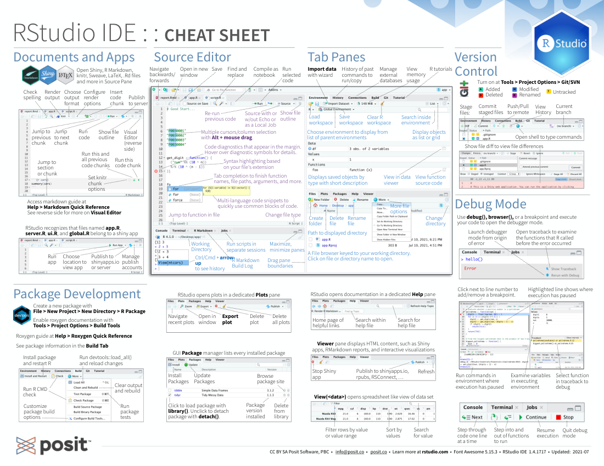

## Posit Cheatsheets

The cheatsheets make it easy to learn about and use some of our favorite packages. They are published in their respective PDF versions here: https://posit.co/resources/cheatsheets/, some are also available in the RStudio IDE under Help > Cheatsheets.

We are also starting to make some cheatsheets available in a more accessible, text-based HTML format. These are available at https://rstudio.github.io/cheatsheets/.

This repository contains the source files of the current, archived and translated versions.

The cheatsheets use the creative commons copyright. Please see the LICENSE document for more details.

## Translations

If you wish to contribute to this effort by translating a cheatsheet, please feel free to use the source Keynote file. To submit a translation, please use a Pull Request via GitHub. See the [contributing guidelines](https://github.com/rstudio/cheatsheets/blob/main/.github/CONTRIBUTING.md) for more information.

## HTML cheatsheets

If you wish to provide an HTML cheatsheet version, please create a Pull Request 
with a new `.qmd` file in the `html/` directory of this repository. Use one of 
the existing `qmd` files there as a starting point/template. These should not be duplicates of the pdf versions - they should be text-based so they are more accessible
to people with visual impairments. Use of images should be minimized, and any images should include appropriate alternative text.

## Tips for making a new cheatsheet

**Cheatsheets are not meant to be text or documentation!** They are scannable visual aids that use layout and visual mnemonics to help people zoom to the functions they need. Think of cheatsheets as a quick reference, with the emphasis on quick. Here's an analogy:

> A cheatsheet is more like a well-organized computer menu bar that leads you to a command than like a manual that documents each command.

Everything about your cheatsheet should be designed to lead users to essential information _quickly_.  If you are summarizing the documentation manual, you are doing it wrong! Here are some tips to help you do it right:

### Getting Started

1. RStudio cheatsheets are hosted at https://github.com/rstudio/cheatsheets. You can submit new cheatsheets to the repository with a pull request. See the [contributing guidelines](https://github.com/rstudio/cheatsheets/blob/main/.github/CONTRIBUTING.md) for more information.

1. The files [keynotes/0-template.key](https://github.com/rstudio/cheatsheets/blob/main/keynotes/0-template.key) and [powerpoints/0-template.ppt](https://github.com/rstudio/cheatsheets/blob/main/powerpoints/0-template.pptx) are official templates that contain some helpful tips.

1. You may find it easiest to create a new cheatsheet by duplicating the most recent Keynote / Powerpoint cheatsheet and then heavily editing it—that's what I do!

### Process

Budget more time than you expect to make the sheets. So far, I've found this process to be the least time consuming:

1.  **Identify which functions to include** by reading the package web page and vignettes. I try to limit my cheatsheets to the essentials.

2.  **Organize the functions** into meaningful, self-explanatory groups. Each group should address a common problem or task.

3.  **Think about how to visualize the purpose of each function.** Visual mnemonics are easier to scan than text, which all looks the same.

4.   **Think about** what **key mental models**, definitions, or explanations the cheatsheet should contain in addition to the functions. Ideally, use these to explain the visualizations.

5.   **Sketch out several possible layouts** for the sheet. Take care to put the more basic and/or pre-requisite content above and to the left of other content. Try to keep related content on the same side of the page. often your final layout will itself be a "mental map" for the topic of the cheatsheet.

6.   **Type out all of the explanations and function descriptions** that you plan to include. Lay them out. Use placeholders for the visuals. Verify that everything fits. White space is very important. Use it to make the sheet scannable and to isolate content groups. Retain white space, even if it means smaller text.

7.  **Make the visuals.** They take the longest, so I save them for last or make them as I do step 6.

8.  **Tweak until happy.**

### Visual Design

1. **Use the existing theme** that you see in the cheatsheets. It is cohesive and black and white printer friendly.

1. **Choose a highlight color** to use throughout your cheatsheet, and repeat this highlight color in the background of the top right corner.  Ideally you could find a color that is different enough from the other cheatsheets that you can quickly tell yours apart when flipping through a booklet of cheatsheets.

1. **Use a second color sparingly or not at all** to draw attention to where it is needed and to differentiate different groupings of content.

1. **Include lots of white space.**

1. **Visually differentiate groups of content.** Backgrounds, boxes, side bars, and headers are helpful here. It is very useful for the user to know immediately where one group of content begins and where one ends. Our "gradation headers" fail here, so think of better solutions if possible.

1. **Align things** to guides, i.e. align things across the page. It helps define the white space and makes the cheat more orderly and professional.

1. **Make the text no smaller than ~10pt.**

1. **If the letters are white on a colored background**, make the font thicker - semibold or bold.

1. **Save bold text** for simple, important statements, or to draw scanning eyes to important words, such as words that identify the topic discussed. Don't make an entire paragraph bold text.

### Content

1. **Include a hex sticker, IDE screenshot, or other branding material**. The cheatsheets have a second function as marketing material.

1. **Include a [Creative Commons Copyright](https://creativecommons.org/)** to make the sheet easy to share. You'll find one baked into every cheatsheet and the template.

1. **Be very concise** - rely on diagrams where possible.

1. **Pay attention to the details!** Your readers sure will... so be correct.

1. **If in doubt, leave it out.** There is a documentation manual after all.

1. **Code comments inform, but fail** to draw the readers attention. It is better to use arrows, speech bubbles, etc. for important information. If it is not important information, leave it out.

1. **Simple working examples are more helpful than documentation details.** They meet the user at his or her pain points, demonstrating code, and reminding users how to run it, with the least context shifting.

1. Add some concise text to **help the user make sense of your sections and diagrams**. Images are best, but readers need to be able to interpret them.

### Summary

Your cheatsheet has two goals. First, to help users find essential information quickly, and second, to prevent confusion while doing the above. Your best strategy will be to limit the amount of information you put into the cheatsheet and to lay that information out intuitively and visually. This approach will make your cheatsheet equally useful as a teaching tool, programming tool, or marketing tool.

Cheatsheets fall squarely on the _human-facing side of software design_. They focus on human attention. What does that mean? When you write documentation, your job is to fill in all of the relevant details—that's a software facing job, you need to know the software to do it. You assume that interested humans will find their way to your details on their own (and understand them when they do!). When you make a cheatsheet, your job flips. You assume that the relevant details already exist in the documentation. Your job is to help interested humans find them and understand them.  Your job is to guide the human's attention. Don't just write, design.

## Website

This repo is deployed as a quarto website at https://rstudio.github.io/cheatsheets/.
It uses [renv](https://rstudio.github.io/renv/) to manage the dependencies to render
the site (in particular the `html/*.qmd` files that generate the HTML cheatsheets). Packages that are required to render these cheatsheets should be list in `DESCRIPTION`
so that they are reliably discovered by `renv::snapshot()`.

We prefer the Quarto cheatsheets to set `eval: true` and `output: false` in the
`execute` options (vs `eval: false`) as this helps to ensure the code in them still works when they are rerun.
Exceptions can be made on a per-chunk basis, and some (e.g., keras) are not 
really feasible to run all the time due to complex installation.