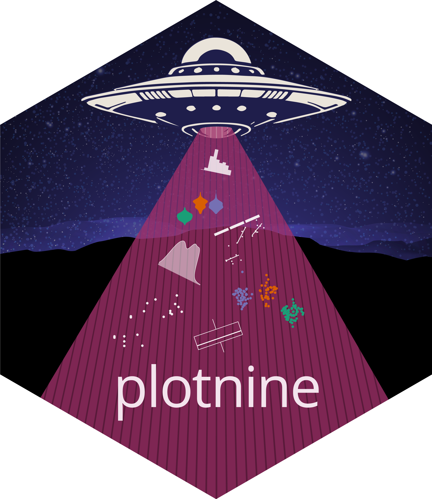

 <br><br>

```{r}
#| eval: true
#| output: asis
#| echo: false
#| column: margin
source("common.R")
sheet_name <- "plotnine"
pdf_preview_link(sheet_name)
translation_list(sheet_name)
```

<!-- Page 1 -->

## Basics

**Plotnine** is based on the **grammar of graphics**, the idea that you can build every plot from the same components: a **data frame**, a **coordinate system**, and **geoms**---visual marks that represent data points.

To display values, map columns in the data to visual properties of the geom (**aesthetics**) like **size**, **color**, and **x** and **y** locations.

Complete the template below to build a plot. Data, a Geom Function, and Aes Mappings are required. Stat, Position, and the Coordinate, Facet, Scale, and Theme functions are not required and will supply sensible defaults.

```{python}
from plotnine import *
from plotnine.data import *

(
    ggplot(data=data_frame)  # required
    + geom_function(  # required
        mapping=aes(**mappings),  # required
        stat=stat,
        position=position,
    )
    + coord_function()
    + facet_function()
    + scale_function()
    + theme(**settings)
)
```

For example:

```{python}
p = ggplot(mpg, aes("cty", "hwy")) + geom_point()

p.save("plot.png", width=6, height=4, dpi=200)
```

## Aesthetics

Common properties and values.

-   `color` and `fill`: Color name or `"#RRGGBB"`.

-   `linetype`: String one of `["solid", "dashed", "dashdot", "dotted"]` or tuple of the form `(offset, (on, off, on, off, ...))`.

-   `size`: Integer (in points).

-   `linewidth`: Integer (in points).

-   `shape`: Character or integer. Plotnine accepts the R-style shape integers (`0`--`25`) as well as Matplotlib marker strings (`"o"`, `"^"`, `"s"`, `"D"`, `"v"`, etc.).

## Geoms

Use a geom function to represent data points, use the geom's aesthetic properties to represent variables. Each function returns a layer.

### Graphical primitives

```{python}
a = ggplot(economics, aes("date", "unemploy"))

b = ggplot(seals, aes(x="long", y="lat"))
```

-   `a + geom_blank()`: Ensure limits include values across all plots.

-   `a + geom_path(lineend="butt", linejoin="round", linemitre=1)`: Connect observations in the order they appear.
    `aes()` arguments: `x`, `y`, `alpha`, `color`, `group`, `linetype`, `size`.

-   `a + geom_polygon(aes(alpha=50))`: Connect points into polygons.
    `aes()` arguments: `x`, `y`, `alpha`, `color`, `fill`, `group`, `subgroup`, `linetype`, `size`.

-   `b + geom_rect(aes(xmin="long", ymin="lat", xmax="long+1", ymax="lat+1"))`: Draw a rectangle by connecting four corners (`xmin`, `xmax`, `ymin`, `ymax`).
    `aes()` arguments: `xmin`, `xmax`, `ymin`, `ymax`, `alpha`, `color`, `fill`, `linetype`, `size`.

-   `a + geom_ribbon(aes(ymin="unemploy-900", ymax="unemploy+900"))`: For each `x`, plot an interval from `ymin` to `ymax`.
    `aes()` arguments: `x`, `ymin`, `ymax`, `alpha`, `color`, `fill`, `group`, `linetype`, `size`.

#### Line segments

Common aesthetics: `x`, `y`, `alpha`, `color`, `linetype`, `size`.

-   `b + geom_abline(aes(intercept=0, slope=1))`: Draw a diagonal reference line with a given `slope` and `intercept`.

-   `b + geom_hline(aes(yintercept="lat"))`: Draw a horizontal reference line with a given `yintercept`.

-   `b + geom_vline(aes(xintercept="long"))`: Draw a vertical reference line with a given `xintercept`.

-   `b + geom_segment(aes(yend="lat+1", xend="long+1"))`: Draw a straight line from `(x, y)` to `(xend, yend)`.

-   `b + geom_spoke(aes(angle="1:1155", radius=1))`: Draw line segments using polar coordinates (`angle` and `radius`).

### One continuous variable

```{python}
c = ggplot(mpg, aes(x="hwy"))
c2 = ggplot(mpg)
```

-   `c + geom_area(stat="bin")`: Draw an area plot.
    `aes()` arguments: `x`, `y`, `alpha`, `color`, `fill`, `linetype`, `size`.

-   `c + geom_density(kernel="gaussian")`: Compute and draw kernel density estimates.
    `aes()` arguments: `x`, `y`, `alpha`, `color`, `fill`, `group`, `linetype`, `size`, `weight`.

-   `c + geom_dotplot()`: Draw a dot plot.
    `aes()` arguments: `x`, `y`, `alpha`, `color`, `fill`.

-   `c + geom_freqpoly()`: Draw a frequency polygon.
    `aes()` arguments: `x`, `y`, `alpha`, `color`, `group`, `linetype`, `size`.

-   `c + geom_histogram(binwidth=5)`: Draw a histogram.
    `aes()` arguments: `x`, `y`, `alpha`, `color`, `fill`, `linetype`, `size`, `weight`.

-   `c2 + geom_qq(aes(sample="hwy"))`: Draw a quantile-quantile plot.
    `aes()` arguments: `x`, `y`, `alpha`, `color`, `fill`, `linetype`, `size`, `weight`.

### One discrete variable

```{python}
d = ggplot(mpg, aes("fl"))
```

-   `d + geom_bar()`: Draw a bar chart.
    `aes()` arguments: `x`, `alpha`, `color`, `fill`, `linetype`, `size`, `weight`.

### Two continuous variables

```{python}
e = ggplot(mpg, aes(x="cty", y="hwy"))
```

-   `e + geom_label(aes(label="cty"), nudge_x=1, nudge_y=1)`: Add text with a rectangle background.
    `aes()` arguments: `x`, `y`, `label`, `alpha`, `angle`, `color`, `family`, `fontface`, `hjust`, `lineheight`, `size`, `vjust`.

-   `e + geom_point()`: Draw a scatter plot.
    `aes()` arguments: `x`, `y`, `alpha`, `color`, `fill`, `shape`, `size`, `stroke`.

-   `e + geom_quantile()`: Fit and draw quantile regression for the plot data.
    `aes()` arguments: `x`, `y`, `alpha`, `color`, `group`, `linetype`, `size`, `weight`.

-   `e + geom_rug(sides="bl")`: Draw a rug plot.
    `aes()` arguments: `x`, `y`, `alpha`, `color`, `linetype`.

-   `e + geom_smooth(method="lm")`: Plot smoothed conditional means.
    `aes()` arguments: `x`, `y`, `alpha`, `color`, `fill`, `group`, `linetype`, `size`, `weight`.

-   `e + geom_text(aes(label="cty"), nudge_x=1, nudge_y=1)`: Add text to a plot.
    `aes()` arguments: `x`, `y`, `label`, `alpha`, `angle`, `color`, `family`, `fontface`, `hjust`, `lineheight`, `size`, `vjust`.

### One discrete, one continuous variable

```{python}
f = ggplot(mpg, aes(x="class", y="hwy"))
```

-   `f + geom_col()`: Draw a bar plot.
    `aes()` arguments: `x`, `y`, `alpha`, `color`, `fill`, `group`, `linetype`, `size`.

-   `f + geom_boxplot()`: Draw a box plot.
    `aes()` arguments: `x`, `y`, `lower`, `middle`, `upper`, `ymax`, `ymin`, `alpha`, `color`, `fill`, `group`, `linetype`, `shape`, `size`, `weight`.

-   `f + geom_dotplot(binaxis="y", stackdir="center")`: Draw a dot plot.
    `aes()` arguments: `x`, `y`, `alpha`, `color`, `fill`, `group`.

-   `f + geom_violin(scale="area")`: Draw a violin plot.
    `aes()` arguments: `x`, `y`, `alpha`, `color`, `fill`, `group`, `linetype`, `size`, `weight`.

### Two discrete variables

```{python}
g = ggplot(diamonds, aes(x="cut", y="color"))
```

-   `g + geom_count()`: Plot a count of points in an area to address overplotting.
    `aes()` arguments: `x`, `y`, `alpha`, `color`, `fill`, `shape`, `size`, `stroke`.

-   `e + geom_jitter(height=2, width=2)`: Jitter points in a plot.
    `aes()` arguments: `x`, `y`, `alpha`, `color`, `fill`, `shape`, `size`.

### Continuous function

```{python}
h = ggplot(economics, aes("date", "unemploy"))
```

-   `h + geom_area()`: Draw an area plot.
    `aes()` arguments: `x`, `y`, `alpha`, `color`, `fill`, `linetype`, `size`.

-   `h + geom_line()`: Connect data points, ordered by the x axis variable.
    `aes()` arguments: `x`, `y`, `alpha`, `color`, `group`, `linetype`, `size`.

-   `h + geom_step(direction="hv")`: Draw a stairstep plot.
    `aes()` arguments: `x`, `y`, `alpha`, `color`, `group`, `linetype`, `size`.

### Continuous bivariate distribution

```{python}
i = ggplot(diamonds, aes("carat", "price"))
```

-   `i + geom_bin_2d(binwidth=[0.25, 500])`: Draw a heatmap of 2D rectangular bin counts.
    `aes()` arguments: `x`, `y`, `alpha`, `color`, `fill`, `linetype`, `size`, `weight`.

-   `i + geom_density_2d()`: Plot contours from 2D kernel density estimation.
    `aes()` arguments: `x`, `y`, `alpha`, `color`, `group`, `linetype`, `size`.

### Visualizing error

```{python}
import polars as pl

df = pl.DataFrame({"grp": ["A", "B", "C"], "fit": [4, 5, 6], "se": [1, 2, 1]})
j = ggplot(df, aes("grp", "fit", ymin="fit-se", ymax="fit+se"))
```

-   `j + geom_crossbar(fatten=2)`: Draw a crossbar.
    `aes()` arguments: `x`, `y`, `ymax`, `ymin`, `alpha`, `color`, `fill`, `group`, `linetype`, `size`.

-   `j + geom_errorbar()`; `j + geom_errorbarh()`: Draw an errorbar.
    `aes()` arguments: `x`, `ymax`, `ymin`, `alpha`, `color`, `group`, `linetype`, `size`, `width`.

-   `j + geom_linerange()`: Draw a line range.
    `aes()` arguments: `x`, `ymin`, `ymax`, `alpha`, `color`, `group`, `linetype`, `size`.

-   `j + geom_pointrange()`: Draw a point range.
    `aes()` arguments: `x`, `y`, `ymin`, `ymax`, `alpha`, `color`, `fill`, `group`, `linetype`, `shape`, `size`.

### Three continuous variables

```{python}
import polars as pl

seals = pl.DataFrame(seals).with_columns(
    z=(pl.col("delta_long")**2 + pl.col("delta_lat")**2).sqrt()
)
l = ggplot(seals, aes("long", "lat"))
```

-   `l + geom_contour(aes(z="z"))`: Draw 2D contour plot.
    `aes()` arguments: `x`, `y`, `z`, `alpha`, `color`, `group`, `linetype`, `size`, `weight`.

-   `l + geom_contour_filled(aes(fill="z"))`: Draw 2D contour plot with the space between lines filled.
    `aes()` arguments: `x`, `y`, `alpha`, `color`, `fill`, `group`, `linetype`, `size`, `subgroup`.

-   `l + geom_raster(aes(fill="z"), hjust=0.5, vjust=0.5, interpolate=False)`: Draw a raster plot.
    `aes()` arguments: `x`, `y`, `alpha`, `fill`.

-   `l + geom_tile(aes(fill="z"))`: Draw a tile plot.
    `aes()` arguments: `x`, `y`, `alpha`, `color`, `fill`, `linetype`, `size`, `width`.

### Maps

```{python}
import geopandas as gp
import geodatasets as gd

np = gp.read_file(gd.get_path("geoda.nepal"))
```

-   `ggplot(np) + geom_map(aes(fill="population"))`: Draw the appropriate geometric object depending on the simple features present in the data.

<!-- Page 2 -->

## Stats

An alternative way to build a layer.

A stat builds new variables to plot (e.g., count, prop).

Visualize a stat by changing the default stat of a geom function, `geom_bar(stat="count")`, or by using a stat function, `stat_count(geom="bar")`, which calls a default geom to make a layer (equivalent to a function). Use `after_stat(name)` syntax to map the stat variable `name` to an aesthetic.

```{python}
i + stat_density_2d(aes(fill=after_stat("level")), geom="polygon")
```

In this example, `"polygon"` is the geom to use, `stat_density_2d()` is the stat function, `aes()` contains the geom mappings, and `level` is the variable created by the stat.

-   `c + stat_bin(binwidth=1, boundary=10)`: `x`, `y` \| `count`, `ncount`, `density`, `ndensity`

-   `c + stat_count(width=1)`: `x`, `y` \| `count`, `prop`

-   `c + stat_density(adjust=1, kernel="gaussian")`: `x`, `y` \| `count`, `density`, `scaled`

-   `e + stat_bin_2d(bins=30, drop=True)`: `x`, `y`, `fill` \| `count`, `density`

-   `e + stat_density_2d(contour=True, n=100)`: `x`, `y`, `color`, `size` \| `level`

-   `e + stat_ellipse(level=0.95, segments=51, type="t")`

-   `l + stat_contour(aes(z="z"))`: `x`, `y`, `z`, `order` \| `level`

-   `l + stat_summary_hex(aes(z="z"), bins=30, fun=max)`: `x`, `y`, `z`, `fill` \| `value`

-   `l + stat_summary_2d(aes(z="z"), bins=30, fun=mean)`: `x`, `y`, `z`, `fill` \| `value`

-   `f + stat_boxplot(coef=1.5)`: `x`, `y` \| `lower`, `middle`, `upper`, `width`, `ymin`, `ymax`

-   `f + stat_ydensity(kernel="gaussian", scale="area")`: `x`, `y` \| `density`, `scaled`, `count`, `n`, `violinwidth`, `width`

-   `e + stat_ecdf(n=40)`: `x`, `y` \| `x`, `y`

-   `e + stat_quantile(quantiles=(0.1, 0.9), formula="y ~ np.log(x)")`: `x`, `y` \| `quantile`

-   `e + stat_smooth(method="lm", formula="y ~ x", se=True, level=0.95)`: `x`, `y` \| `se`, `x`, `y`, `ymin`, `ymax`

```{python}
import scipy.stats as stats
ggplot() +
  lims(x=(-5, 5)) +
  stat_function(fun=stats.norm.pdf, n=20, geom="point") # x | y
    
ggplot() +
  stat_qq(aes(sample=range(100))) # x | y, sample, theoretical
```

-   `e + stat_sum()`: `x`, `y`, `size` \| `n`, `prop`

-   `e + stat_summary(fun_data="mean_cl_boot")`

-   `h + stat_summary_bin(fun="mean", geom="bar")`

-   `e + stat_identity()`

-   `e + stat_unique()`

## Scales

Override default mappings.

**Scales** map data values to the visual values of an aesthetic. To change a mapping, add a new scale.

```{python}
n = d + geom_bar(aes(fill="fl"))

n + scale_fill_manual(
    values=["palegreen", "green", "forestgreen", "darkgreen"],
    limits=["d", "e", "p", "r"],
    breaks=["d", "e", "p", "r"],
    labels=["D", "E", "P", "R"],
    name="fuel")
```

In this example, `scale_` specifies a scale function, `fill` is the aesthetic to adjust, and `manual` is the prepackaged scale to use.

`values` contains scale-specific arguments, `limits` specifies the range of values to include in mappings, `breaks` specifies the breaks to use in the legend/axis, and `name` and `labels` specify the title and labels to use in the legend/axis.

### General purpose scales

Use with most aesthetics.

-   `scale_*_continuous()`: Map continuous values to visual ones.

-   `scale_*_discrete()`: Map discrete values to visual ones.

-   `scale_*_binned()`: Map continuous values to discrete bins.

-   `scale_*_identity()`: Use data values literally.

-   `scale_*_manual(values=[])`: Map discrete values to manually chosen visual ones.

-   `scale_*_date(date_labels="%d/%m", date_breaks="2 weeks")`: Treat data values as dates.

-   `scale_*_datetime()`: Treat data values as date times.

### X and Y location scales

Use with x or y aesthetics (x shown here).

-   `scale_x_log10()`: Plot `x` on log10 scale.

-   `scale_x_reverse()`: Reverse the direction of the x axis.

-   `scale_x_sqrt()`: Plot `x` on square root scale.

### Color and fill scales, discrete

-   `n + scale_fill_brewer(palette="Blues")`: Use color scales from ColorBrewer.

-   `n + scale_fill_grey(start=0.2, end=0.8, na_value="red")`: Use a grey gradient color scale.

### Color and fill scales, continuous

```{python}
o = c + geom_dotplot(aes(fill="x"))
```

-   `o + scale_fill_distiller(palette="Blues")`: Interpolate a palette into a continuous scale.

-   `o + scale_fill_gradient(low="red", high="yellow")`: Create a two color gradient.

-   `o + scale_fill_gradient2(low="red", high="blue", mid="white", midpoint=25)`: Create a diverging color gradient.

-   `o + scale_fill_gradientn(colors=["green", "purple", "papayawhip"])`: Create an n-color gradient.

### Shape and size scales

```{python}
p = e + geom_point(aes(shape="fl", size="cyl"))
```

-   `p + scale_shape() + scale_size()`: Map discrete values to shape and size aesthetics. See page 1 for shapes.

-   `p + scale_shape_manual(values=["o", "^", "s", "D", "v"])`: Map discrete values to specified shape values.

-   `p + scale_radius(range=range(1, 7))`: Map values to a shape's radius.

-   `p + scale_size_area(max_size=6)`: Like `scale_size()` but maps zero values to zero size.

## Coordinate Systems

```{python}
plt_obj = d + geom_bar()
```

-   `plt_obj + coord_cartesian(xlim=[0, 5])`: `xlim`, `ylim`.
    The default cartesian coordinate system.

-   `plt_obj + coord_fixed(ratio=1/2)`: `ratio`, `xlim`, `ylim`.
    Cartesian coordinates with fixed aspect ratio between x and y units.

-   `plt_obj + coord_flip()`: Flip cartesian coordinates by switching x and y aesthetic mappings.

-   `plt_obj + coord_trans(y="sqrt")`: `x`, `y`, `xlim`, `ylim`.
    Transformed cartesian coordinates.

## Position Adjustments

Position adjustments determine how to arrange geoms that would otherwise occupy the same space.

```{python}
s = ggplot(mpg, aes("fl", fill="drv"))
```

-   `s + geom_bar(position="dodge")`: Arrange elements side by side.

-   `s + geom_bar(position="fill")`: Stack elements on top of one another, normalize height.

-   `e + geom_point(position="jitter")`: Add random noise to X and Y position of each element to avoid overplotting.

-   `e + geom_label(position="nudge")`: Nudge labels away from points.

-   `s + geom_bar(position="stack")`: Stack elements on top of one another.

Each position adjustment can be recast as a function with manual `width` and `height` arguments:

```{python}
s + geom_bar(position=position_dodge(width=1))
```

## Themes

-   `plt_obj + theme_bw()`: White background with grid.

-   `plt_obj + theme_gray()`: Grey background (default).

-   `plt_obj + theme_dark()`: Dark for contrast.

-   `plt_obj + theme_classic()`

-   `plt_obj + theme_light()`

-   `plt_obj + theme_linedraw()`

-   `plt_obj + theme_minimal()`

-   `plt_obj + theme_void()`: Empty theme.

-   `plt_obj + theme()`: Customize aspects of the theme such as axis, legend, panel, and facet properties.

```{python}
plt_obj + theme(plot_title_position="plot")

plt_obj + theme(panel_background=element_rect(fill="blue"))
```

## Faceting

Facets divide a plot into subplots based on the values of one or more discrete variables.

```{python}
t = ggplot(mpg, aes("cty", "hwy")) + geom_point()
```

-   `t + facet_grid(cols="fl")`: Facet into columns based on fl.

-   `t + facet_grid("year")`: Facet into rows based on year.

-   `t + facet_grid("year", "fl")`: Facet into both rows and columns.

-   `t + facet_wrap("fl", ncol=4)`: Wrap facets into a rectangular layout.

Set `scales` to let axis limits vary across facets:

-   `t + facet_grid("drv", "fl", scales="free")`: Also `"free_x"` for x axis limits to adjust to individual facets and `"free_y"` for y axis limits to adjust to individual facets.

Set `labeller` to adjust facet label:

-   `t + facet_grid(cols="fl", labeller="label_both")`: Labels each facet as "fl: c", "fl: d", etc.

## Labels and Legends

Use `labs()` to label the elements of your plot.

```{python}
t + labs(
    x="New x axis label",
    y="New y axis label",
    title="Add a title above the plot",
    subtitle="Add a subtitle below title",
    caption="Add a caption below plot",
    tag="Add a tag to the plot",
    fill="New fill legend title")
```

-   `t + annotate(geom="text", x=8, y=9, label="A")`: Places a geom with manually selected aesthetics.

-   `p + guides(x=guide_axis(n_dodge=2))`: Avoid crowded or overlapping labels with `n_dodge` or `angle`.

-   `n + guides(fill="none")`: Set legend type for each aesthetic: `colorbar`, `legend`, or `none` (no legend).

-   `n + theme(legend_position="bottom")`: Place legend at "bottom", "top", "left", or "right".

-   `n + scale_fill_discrete(name="Title", labels=["A", "B", "C", "D", "E"])`: Set legend title and labels with a scale function.

## Zooming

Without clipping (preferred):

-   `t + coord_cartesian(xlim=[10, 100], ylim=[0, 20])`

With clipping (removes unseen data points):

-   `t + lims(x=(10, 100), y=(0, 20))`: option 1.

-   `t + scale_x_continuous(limits=[10, 100]) + scale_y_continuous(limits=[0, 20])`: option 2.

------------------------------------------------------------------------

CC BY SA Posit Software, PBC • [info\@posit.co](mailto:info@posit.co) • [posit.co](https://posit.co)

Learn more at [plotnine.org](https://plotnine.org).

Updated: `r format(Sys.Date(), "%Y-%m")`.

------------------------------------------------------------------------
