::: column-margin
```{=html}

<br><br>
```
:::

```{r}
#| output: asis
#| echo: false
#| eval: true
#| column: margin
source("common.R")
sheet_name <- tools::file_path_sans_ext(knitr::current_input())
pdf_preview_link(sheet_name)
translation_list(sheet_name)
```

## Overview

Posit Team bundles Posit's premier data science tools, including:

-   **Posit Workbench:** Development environment for creating insights.

-   **Posit Connect:** Hosting environment for accessing and sharing insights.

-   **Posit Package Manager:** R and Python package repository management.

## 1. Open New Session in Posit Workbench

Open a new development session by clicking **+ New Session**.

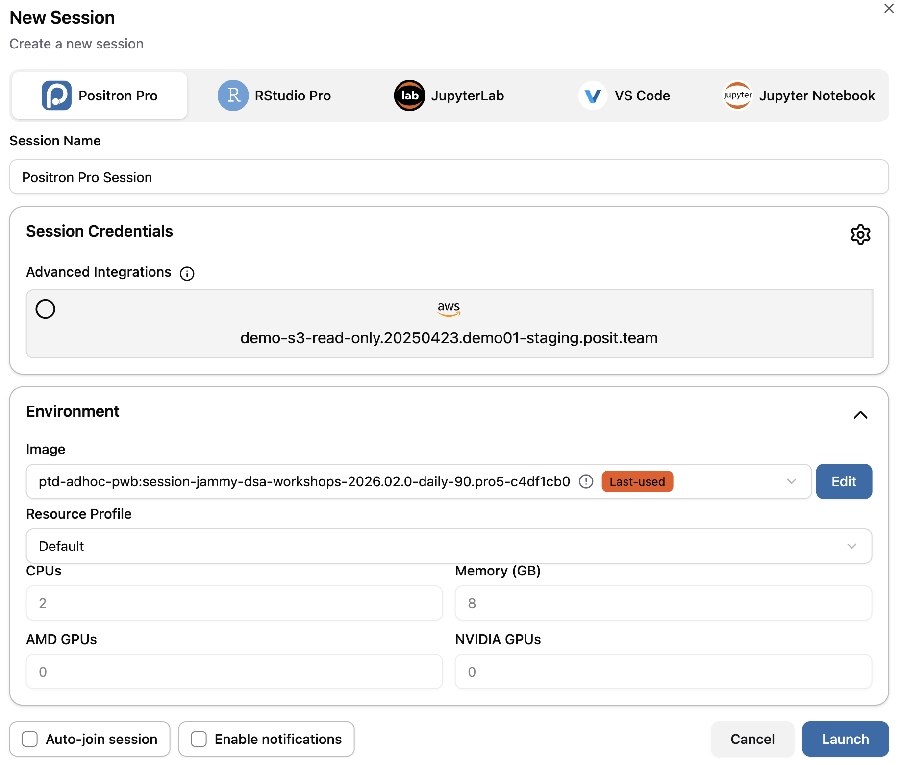{fig-align="center"}

-   Available IDEs include **Positron Pro, RStudio Pro, JupyterLab, VS Code,** and **Jupyter Notebook**.

-   **Cluster Options:** May vary depending on how Posit Workbench is configured in your environment.

## 2. Configure Package Repositories

### Check Current Repositories

Within an R session, you can check your R repositories by running:

```{r}
options("repos")
```

For Python, you can use `pip` to list your current Python repositories:

```{bash}
pip config list
```

### Configure Repositories with Posit Package Manager

To set your R repositories to Posit Package Manager, run:

```{r}
options(repos = c(CRAN = "https://your-package-manager-url.com"))
```

To set your Python repositories to Posit Package Manager, run:

```{bash}
pip config set global.index-url https://your-package-manager-url.com
```

::: callout-tip
Talk to your administrator about configuring your repositories to ensure they persist across sessions.
:::

### Obtaining Package Manager URL

Obtain your repository URL by clicking the **SETUP** button on Posit Package Manager:

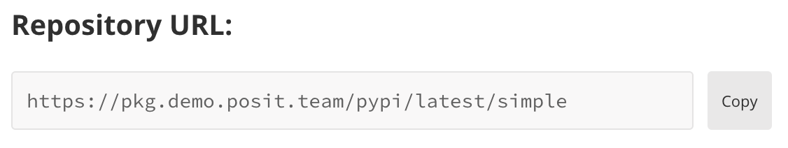{fig-align="center"}

{fig-align="center"}

You can also leverage Posit Public Package Manager for CRAN, PyPI, and Bioconductor packages: <https://p3m.dev/>

## 3. Access Your Data

Access your data within Posit Team no matter where it lives and what format it's in:

-   **Local or Shared Directory:** Examples including `data.csv`, `data.txt`, `data.parquet`.

-   **APIs:** Interact with APIs using packages such as {requests} in Python or {httr2} and {jsonlite} in R.

-   **Pins:** Store and retrieve Python/R objects including data and models.

-   **Databases:** Connect to a variety of database types using DBI/DB-API/ODBC.

::: callout-important
Never hard code credentials! Use environment variables or talk to your administrator about setting up a DSN.
:::

### DBI (Database Interface) Example in R

Below is an example of connecting to a PostgreSQL database using the DBI package in R:

```{r}
con <- DBI::dbConnect(
  RPostgres::Postgres(),
  hostname = "db.company.com",
  port = 5432
)
```

### DB-API (Python Database API) Example in Python

Below is an example of connecting to a database using the `sqlite3` package in Python:

```{python}
con = sqlite3.connect('example.db')
```

### ODBC (Open Database Connectivity)

Below is an example of connecting to a PostgreSQL database using the `odbc` package in R:

```{r}
con <- DBI::dbConnect(
  odbc::odbc(),
  driver = "PostgreSQL Driver",
  database = "test_db",
  UID = Sys.getenv("DB_USER"),
  PWD = Sys.getenv("DB_PASSWORD"),
  host = "localhost",
  port = 5432
)
```

Below is an example of connecting to a PostgreSQL database using the `pyodbc` package in Python:

```{python}
con = pyodbc.connect(
  driver = 'PostgreSQL',
  database = 'test_db',
  server = 'localhost',
  port = 5432,
  uid = os.getenv('DB_USER'),
  pwd = os.getenv('DB_PASSWORD'))
```

### Posit's Professional ODBC Drivers

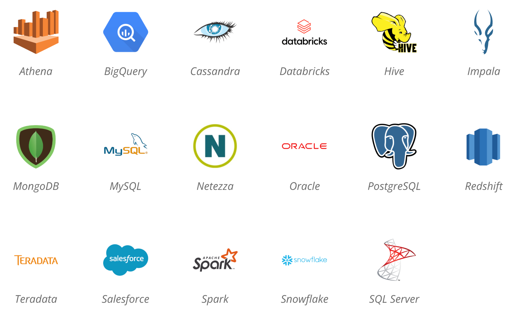{fig-align="center"}

A full list of Posit provided professional ODBC drivers can be found here: <https://docs.posit.co/pro-drivers/>

## 4. Run your Code

Posit Workbench includes multiple options for running your R and Python code, including:

-   Support for multiple Python and R versions.

-   Leverage virtual environments (e.g., `renv`, `venv`) and project-oriented workflows.

-   **RStudio and Positron:** Submit long-running Python/R jobs to Posit Workbench server to run in independent sessions using **Workbench Jobs** (<https://docs.posit.co/ide/server-pro/user/rstudio-pro/guide/workbench-jobs.html>).

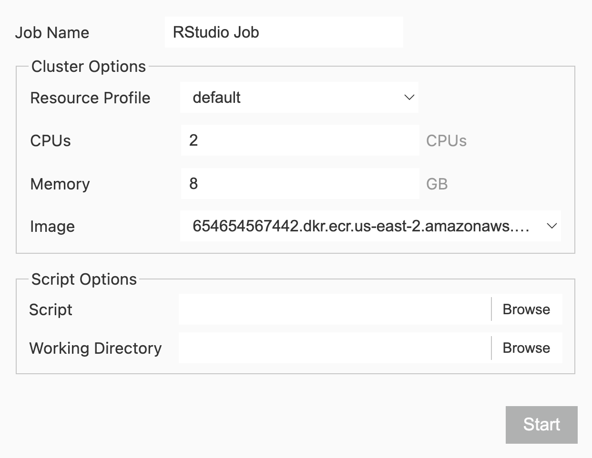{fig-align="center"}

## 5. Supported Content Types on Posit Connect

Currently supported content types on Posit Connect include:

### Documents

-   Quarto

-   R Markdown

-   Jupyter Notebooks

-   Voilà

### Applications

-   Shiny (R and Python)

-   Streamlit

-   Bokeh

-   Dash

-   Panel

### APIs

-   Plumber

-   FastAPI

-   Flask

-   TensorFlow

-   Vetiver

-   Node.js

### Pins

-   Pins

## 6. Publish your Content to Posit Connect

Methods for publishing to Posit Connect include:

-   **`rsconnect`:** Publish content directly from R using the rsconnect R package.
-   **Command Line Interface (CLI):** Publish content using the CLI within the `rsconnect-python` package.
-   **Push Button Deployment:** Publish content with the click of a button using push button deployment. This is natively available within RStudio Pro and Jupyter Notebooks. You can also access push button deployment using the **Posit Publisher** extension in Visual Studio Code.
-   **Git:** Publish directly from a Git repository.

## 7. Share and Control your Content on Posit Connect

::: callout-important
Your Posit Connect configuration and license may restrict which options are available to your content.
:::

Content controls are accessed by clicking the content settings icon.
These settings include:

### General

Easily modify the content's title and description, customize the **Content URL**, add a thumbnail, manage tags, and lock or delete content.

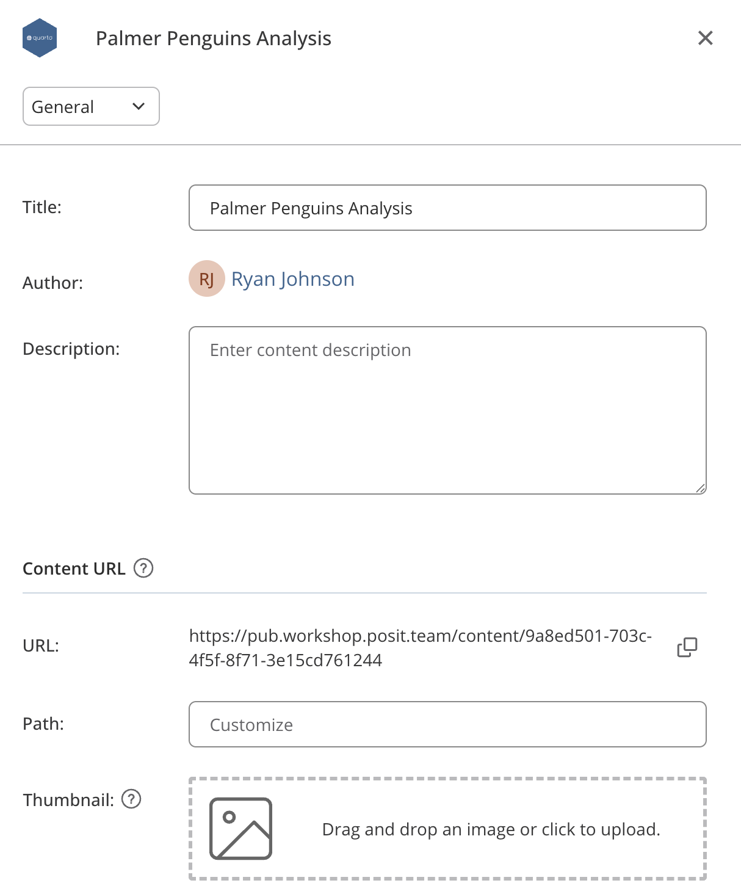{fig-align="center"}

::: callout-note
Share content by sharing the **Content URL**, which can be customized.
:::

### Source

View content bundles, language and Quarto versions, and package dependencies for your content.

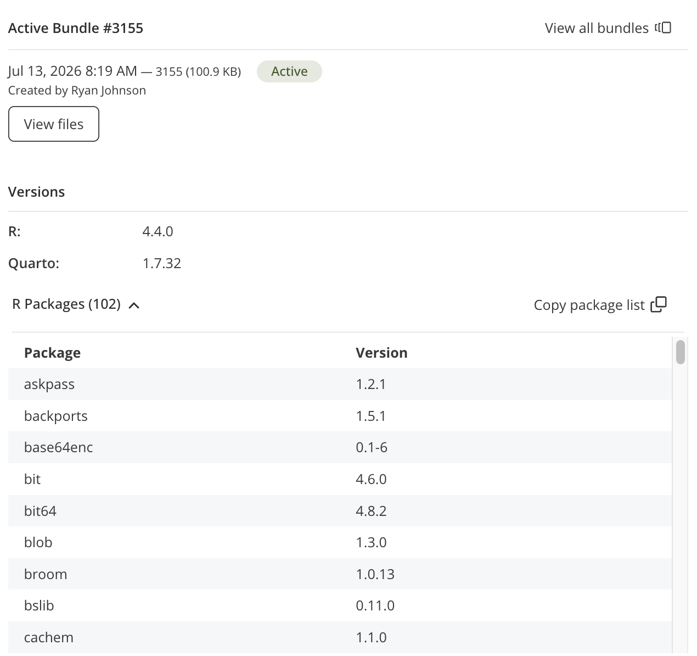{fig-align="center"}

### Access

Configure who can access your content.
Options include:

-   **Anyone - no login required:** Content is public and open to anyone.

-   **All users - login required:** Content available to anyone that can access Posit Connect.

-   **Specific users or groups:** Content is available to specific users (or user groups) defined by the content's owner.

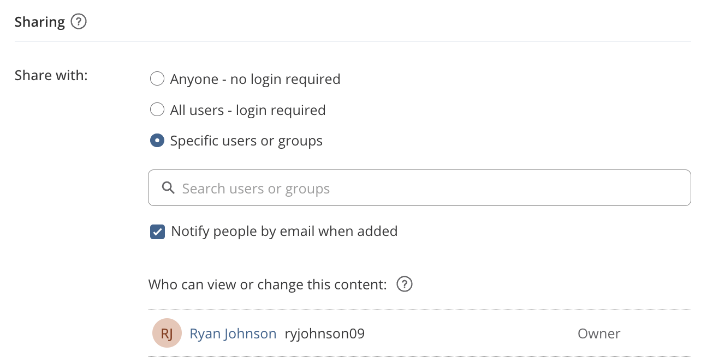{fig-align="center"}

### Runtime Settings

Tune and scale applications and APIs by modifying the number of processes (e.g., Python and R sessions) and connections per process.

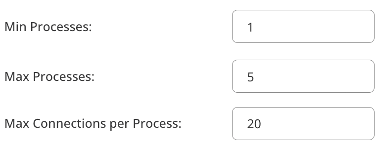{fig-align="center"}

In the above configuration, the content can accommodate up to 100 concurrent connections (20 x 5).
There will also be at least one process always running, meaning the content never goes to sleep.

#### Other Runtime Settings

Easily modify how your content runs by modifying any of the below settings.
Note: some options may not be available depending on how Posit Connect is configured in your environment.

-   **CPU and RAM Settings:** Modify the initial and maximum number of CPUs and amount of RAM content can use.

-   **Timeout Settings:** Control the time thresholds for content startup, idle time, and time since last data sent/received.

-   **Environment Management, Process Execution, and Execution Environment:** Control the environment management strategy, which Unix user runs the content, and the image used to create the content execution container.

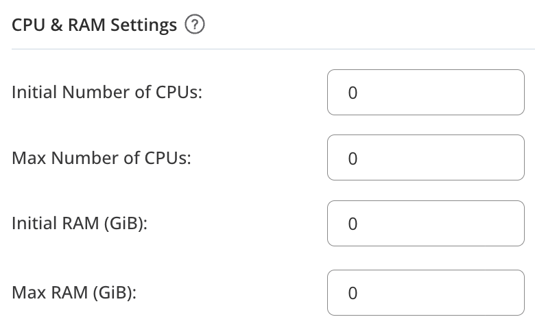{fig-align="center"}

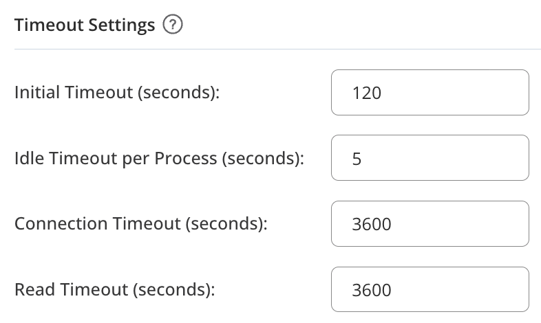{fig-align="center"}

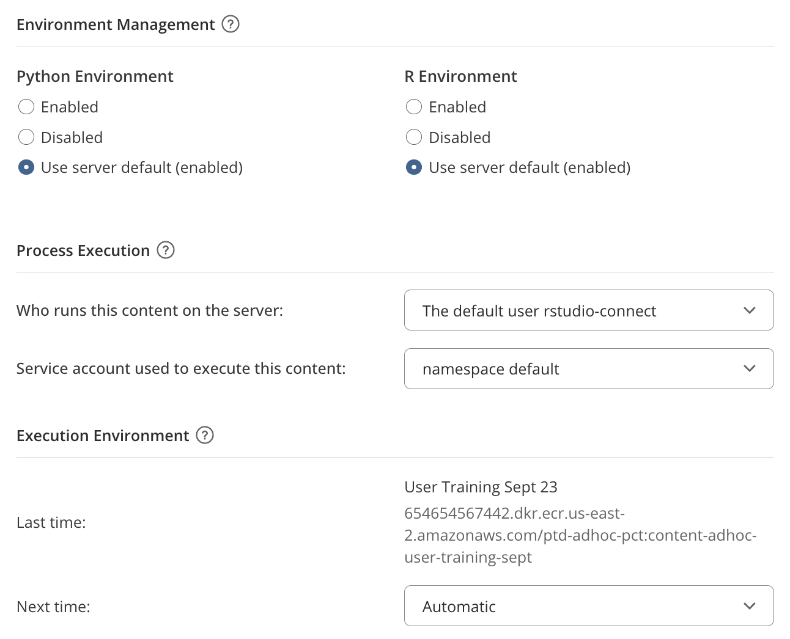{fig-align="center"}

### Schedule

Documents can be configured to execute on a schedule of your choosing.

{fig-align="center"}

Scheduled reports can be configured to send an email to targeted recipients upon successful completion.

{fig-align="center"}

::: callout-tip
Learn how to send custom and conditional emails with R Markdown ([pos.it/rmd_email](https://pos.it/rmd_email)) and Quarto ([pos.it/qmd_email](https://pos.it/qmd_email)).
:::

### Monitor

View the number of visitors to your content and logs.

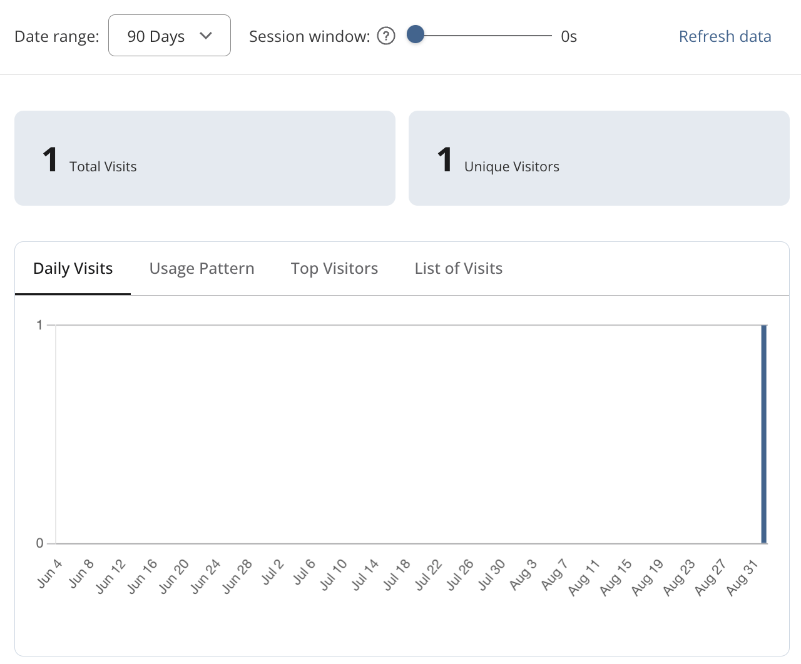{fig-align="center"}

### Environment Variables

Securely pass configuration options to your content as environment variables including **API Keys** and **Passwords**.

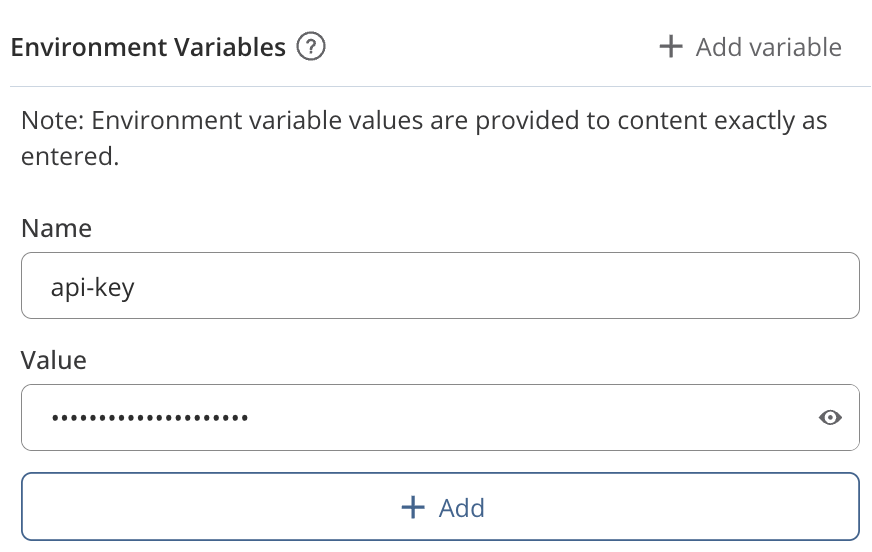{fig-align="center"}

::: callout-caution
Always avoid hard-coding API keys, passwords, or tokens in the source code of content published to Posit Connect.
This is a major security concern!
:::

## Need Help? Want to Learn More?

-   Learn more about Posit Team through free on-demand courses and live workshops at **Posit Academy**: <https://academy.posit.co>

-   **Posit Community:** Open forum for any open source or Posit Team question: <https://forum.posit.co>

-   Posit Team docs: <https://docs.posit.co>

-   Release notes: <https://docs.posit.co/release-notes.html>

-   Questions about sales and licensing: sales\@posit.co

-   Technical issues: support\@posit.co

-   Other questions? info\@posit.co
