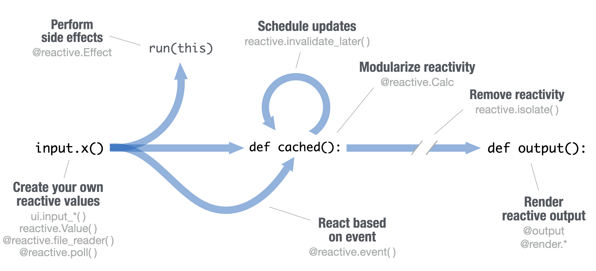

```{r}
#| eval: true
#| output: asis
#| echo: false
#| column: margin
source("common.R")
use_cheatsheet_logo(
  "shiny",
  alt = "Hex logo for Shiny - A blue hexagon with the word 'Shiny' written in white in a flowing cursive font. The tail of the 'y' flows back to the left to underline the word."
)
sheet_name <- tools::file_path_sans_ext(knitr::current_input())
pdf_preview_link(sheet_name)
translation_list(sheet_name)
```

## Build an App

**Shiny** makes it easy to create truly reactive data & AI apps in pure Python. Shiny apps easily scale in complexity and sophistication thanks to its reactivity model and other opinionated design choices.

Collect user input with `ui.input_*()` functions and reactively read those values with `input.<id>()`. Decorate a function with `@render.*` to reactively render Python outputs (re-executing when relevant input changes).

Save your app as `app.py` in a directory along with any supporting code, images, etc.

- **app-name:** The directory name is the app name
- **app.py**
- www/: Place images, CSS, etc. to share with the browser in a folder named "www"
- Include any other scripts, data sets, or assets used by the app in the same directory.

Run `shiny create` in the terminal to generate an `app.py` file based on a template. Launch apps via the VS Code extension or with the `shiny run` CLI.

```{python}
# app.py
import matplotlib.pyplot as plt
import numpy as np
from shiny.express import (
  input, render, ui
)

ui.input_slider(
  "n", "Sample Size", 0, 1000, 50
)

@render.plot
def dist():
  x = np.random.randn(input.n())
  plt.hist(x, range=[-3, 3])
```

Get inspiration and templates by running `shiny create` in the terminal, or from [shiny.posit.co/py/templates](https://shiny.posit.co/py/templates/) and [shiny.posit.co/py/gallery](https://shiny.posit.co/py/gallery/).

Build with AI assistance at [gallery.shinyapps.io/assistant](https://gallery.shinyapps.io/assistant).

## Share

Share your app in three ways:

1.  Host it on [Posit Connect Cloud](https://connect.posit.cloud/), a cloud based service from Posit. To deploy Shiny apps:

    - Create a free or professional account at [connect.posit.cloud](https://connect.posit.cloud/)
    - Publish from GitHub or from VS Code or Positron using the [Posit Publisher extension](https://marketplace.visualstudio.com/items?itemName=Posit.publisher)

2.  Purchase Posit Connect, a publishing platform for R and Python. [posit.co/connect](https://posit.co/products/enterprise/connect/)

3.  Use open source deployment options. [shiny.posit.co/py/docs/deploy.html](https://shiny.posit.co/py/docs/deploy.html)

## Shinylive

Shinylive apps use WebAssembly to run entirely in a browser--no need for a special server to run Python.

- Edit and/or host Shinylive apps at [shinylive.io](https://shinylive.io).
- Create a Shinylive version of an app to deploy with `shinylive export myapp site`. Then deploy to a hosting site like Github or Netlify.
- Embed Shinylive apps in Quarto sites, blogs, etc.

To embed a Shinylive app in a Quarto doc, include the below syntax.

```` markdown
---
filters:
- shinylive
---

An embedded Shinylive app:

```{{shinylive-python}}
#| standalone: true
# [App.py code here...]
```
````

## Outputs

Decorate a function with `@render.*` to reactively render Python outputs. Shiny supports output from many popular Python packages.

- `@render.data_frame`

- `@render.plot`

- `@render.code`

- `@render.text`

- `@render.image`

- `@render.ui`

- `@render.download`

And many more via the **shinywidgets** project:

- `@render_altair`

- `@render_plotly`

- `@render_bokeh`

- `@render_widget`

## Inputs

Collect values from the user. Use a `ui.input_*()` function to make an input widget that saves a value as `input.<id>`. Reactively read input values with `input.<id>()`.

- `ui.input_action_button(id, label, ...)`

- `ui.input_action_link(id, label, ...)`

- `ui.input_task_button(id, label, ...)`

- `ui.input_checkbox(id, label, value, ...)`

- `ui.input_checkbox_group(id, label, choices, selected, ...)`

- `ui.input_dark_mode(id, mode)`

- `ui.input_date(id, label, value, ...)`

- `ui.input_date_range(id, label, start, end, ...)`

- `ui.input_file(id, label, ...)`

- `ui.input_numeric(id, label, value, ...)`

- `ui.input_radio_buttons(id, label, choices, selected, ...)`

- `ui.input_select(id, label, choices, selected, ...)`. Also `ui.input_selectize()`

- `ui.input_slider(id, label, min, max, value, ...)`

- `ui.input_switch(id, label, value, ...)`

- `ui.input_text(id, label, value, ...)`. Also `ui.input_text_area()`

<!-- page 2 -->

## Reactivity

Reactive values work together with reactive functions. A reactive value must be read from within a reactive function to avoid the error `No current reactive context`. The reactive module is located at `shiny.reactive`.

{fig-align="center"}

::: {.callout-note appearance="minimal" icon="false" collapse="true"}
## Expand to read about the reactivity diagram {aria-hidden="true"}

### Phases in the reactivity diagram

- Create your own reactive values
  - `ui.input_*()`
  - `reactive.value()`
  - `@reactive.file_reader()`
  - `@reactive.poll()`
- Perform side effects
  - `@reactive.effect`
- Schedule updates
  - `reactive.invalidate_later()`
- Modularize reactivity
  - `@reactive.calc`
- Remove reactivity
  - `reactive.isolate()`
- React based on event
  - `@reactive.event()`
- Render reactive output
  - `@render.*`
:::

### Create Reactive Calculations

- `@reactive.calc` creates a reactive value from other (reactive) values. Helps avoid redundant logic and unnecessary computation.

- `@render.*` creates a reactive UI or output.

  ```{python}
  from shiny import reactive
  from shiny.express import (
    input, render, ui
  )

  ui.input_text("text", "Enter text")

  @reactive.calc
  def length():
    return len(input.text())

  @render.text
  def length_output():
    return f"{length()} characters"
  ```

### Perform Side Effects

- `@reactive.effect` performs side effects like logging, updating inputs, etc.

  ```{python}
  @reactive.effect
  def length_log():
    print(f"{length()} characters")
  ```

- `reactive.value()` can be useful for programmatically setting/reading a reactive value. This is often useful when the value can't be derived from input values alone.

### React Based on Event

Reactive functions re-execute when any of their reactive dependencies (i.e., values) change. However, sometimes you want to ignore all but one (i.e., event). Don't execute until `input.submit` is truthy (i.e. the button is clicked):

```{python}
ui.input_text("name", "Enter name")
ui.input_action_button("submit", "Submit")

@render.text
@reactive.event(input.submit)
def greeting():
  return f"Hello {input.name()}!"

@reactive.effect
@reactive.event(input.submit)
def log_name():
  print(f"Name submitted {input.name()}")
```

## User Interfaces (UI)

Design delightful UI with a collection of layouts, components, themes, & more.

### Page layouts

- `with ui.sidebar():` - Sidebar

- `with ui.nav_panel():` - Multi-page

```{python}
ui.page_opts(
  fillable=True,   # Filling (vertical) layout
  full_width=True) # Full-width page
```

### UI layouts

#### Multiple columns

- with `ui.layout_columns()` - 12-col grid

- with `ui.layout_column_wrap()` - Equal-width cols

- with `ui.layout_sidebar()` - Resizable 2-cols

#### Multiple panels

Navigate a set of `nav_panel()`s in various ways with `navset_card_*`.

```{python}
with ui.navset_card_underline():
  with ui.nav_panel("One"):
    "1st panel"
  with ui.nav_panel("Two"):
    "2nd panel"
  with ui.nav_menu("Menu"):
    with ui.nav_panel("3"):
      "3rd panel"
```

### Cards

Visually group UI elements together with the `card()` component.

```{python}
with ui.card():
  ui.card_header("Title")
  @render.plot
  def plot():
    ...
```

### Accordions

```{python}
with ui.accordion():
  with ui.accordion_panel("One"):
    "1st panel"
  with ui.accordion_panel("Two"):
    "2nd panel"
  with ui.accordion_panel("Three"):
    "3rd panel"
```

Tip: place within `ui.sidebar()` to group similar inputs.

### Tooltips & icons

```{python}
from faicons import icon_svg
with ui.tooltip():
  icon_svg("info-circle")
  "Tooltip message"
```

### Value boxes

```{python}
with ui.value_box(
  showcase=icon
):
  "Title"
  "Value"
```

## Custom UI

Make the app behave and look exactly how you want it with web tooling and theming.

### UI as HTML

Shiny UI is powered by HTML (plus JS/CSS):

```{python}
ui.page_fluid(class = "pt-3")
#> <div class="container-fluid pt-3"></div>
```

- Create bespoke experiences with custom HTML (`ui.tags`) and CSS/JS snippets: `ui.include_css()` / `ui.include_js()`.

- Can also interface with popular frameworks like React, Vue, Svelte, etc.

### Local files

Statically serve any file (image, CSS, JS, etc) by placing them in the `www/` dir (next to `app.py`).

### Themes

Choose from a set of pre-packaged themes via **shinyswatch**, or change main colors/fonts via **brand-yml**.

```{.yaml}
color:
  foreground: '#222'
  background: white
  primary: purple
typography:
  fonts:
    - family: Inter
      source: google
```

## Gen AI

Build streaming Gen AI interfaces like chatbots and more with the `Chat` and `MarkdownStream` components.

Use `Chat` to implement a streaming chat interface. Provide a callback to generate a response to `user_input` using an AI framework of your choice (e.g., chatlas, LangChain, etc).

```{python}
from chatlas import ChatOpenAI
from shiny.express import ui

chat_client = ChatOpenAI()
chat = ui.Chat("chat")
chat.ui(
  messages=["**Hi!** How can I help?"]
)

@chat.on_user_submit
async def _(user_input: str):
  x = await chat_client.stream_async(
    user_input
  )
  await chat.append_message_stream(x)
```

## Express / Core

- An `app.py` that imports from `shiny.express` uses 'Express mode' to make development faster.

- Express extends "Core" Shiny to make UI and server logic one in the same.

- Core may be more suitable for sophisticated apps where a decoupling of UI and server is beneficial.

```{python}
import matplotlib.pyplot as plt
import numpy as np
from shiny import App, ui

app_ui = ui.page_fixed(
  ui.input_slider(
    "n", "Sample Size", 0, 100, 50
  )
)

def server(input):
  @render.plot
  def dist():
    x = np.random.randn(input.n())
    plt.hist(x, range=[-3, 3])

app = App(app_ui, server)
```

------------------------------------------------------------------------

CC BY SA Posit Software, PBC • [info\@posit.co](mailto:info@posit.co) • [posit.co](https://posit.co)

Learn more at [shiny.posit.co/py](https://shiny.posit.co/py/)

Updated: `r format(Sys.Date(), "%Y-%m")`.

------------------------------------------------------------------------
