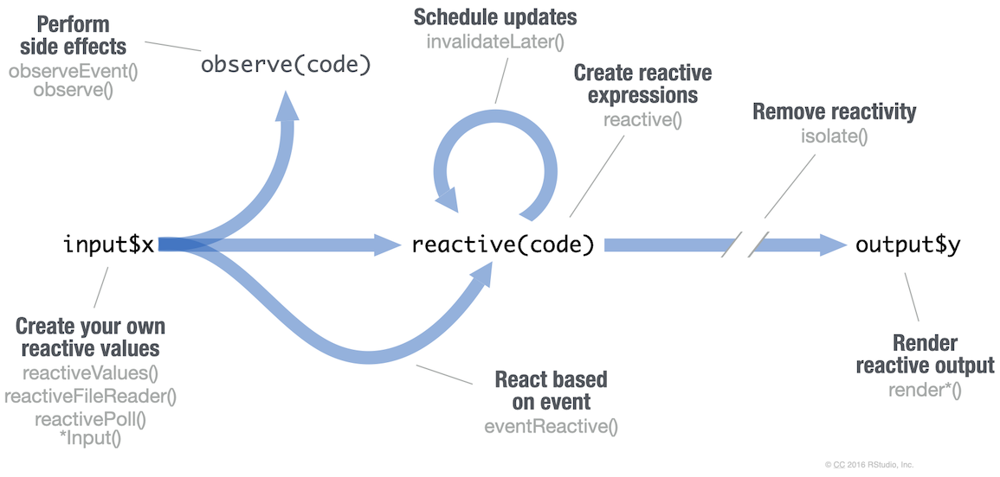

```{r}
#| eval: true
#| output: asis
#| echo: false
#| column: margin
source("common.R")
use_cheatsheet_logo(
  "shiny",
  alt = "Hex logo for Shiny - A blue hexagon with the word 'Shiny' written in white in a flowing cursive font. The tail of the 'y' flows back to the left to underline the word."
)
sheet_name <- tools::file_path_sans_ext(knitr::current_input())
pdf_preview_link(sheet_name)
translation_list(sheet_name)
```

## Build an App

A **Shiny** app is a web page (`ui`) connected to a computer running a live R session (`server`).

```{r}
library(shiny)
```

Users can manipulate the UI, which will cause the server to update the UI's displays (by running R code).

- The **UI** is a collection of input, output, and layout elements.
- The **server** determines how to render outputs given inputs.
- An **app** is a combination of UI and server.

Create `*Input()` UI elements and read them with `input$<id>`. Match `*Output()` elements with `render*()` functions.

```{r}
# app.R
library(shiny)

ui <- bslib::page_fluid(
  sliderInput("n", "Sample size", 0, 100, 25),
  plotOutput("hist")
)

server <- function(input, output) {
  output$hist <- renderPlot({
    hist(rnorm(input$n))
  })
}

shinyApp(ui, server)
```

Save `shinyApp()` to `app.R`. Keep your app in a directory along with optional supporting code, images, etc.

- **app-name:** The directory name is the app name
- **app.R**
- R/: (optional) directory of supplemental .R files that are sourced automatically
- www/: (optional) directory of files to share with web browsers (images, CSS, .js, etc.)

Launch an `app.R` with `runApp("path/to/app-name")`.

Get inspiration and examples from [shiny.posit.co/r/gallery](https://shiny.posit.co/r/gallery), [shinylive.io/r/examples](https://shinylive.io/r/examples/), or by running `runExample()` in the R console.

Build with AI assistance at [gallery.shinyapps.io/assistant](https://gallery.shinyapps.io/assistant).

## Share

Share your app in four ways:

1.  Host it on [Posit Connect Cloud](https://connect.posit.cloud/), a cloud based service from Posit. To deploy Shiny apps:

    - Create a free or professional account at [connect.posit.cloud](https://connect.posit.cloud/)
    - Publish from RStudio, GitHub, or from VS Code or Positron using the [Posit Publisher extension](https://marketplace.visualstudio.com/items?itemName=Posit.publisher)

2.  Purchase Posit Connect, a publishing platform for R and Python. [posit.co/connect](https://posit.co/products/enterprise/connect/)
3.  Host your own Shiny Server. [posit.co/products/open-source/shinyserver](https://posit.co/products/open-source/shiny-server/)
4.  Export to Shinylive, a technology for running apps entirely in the browser. [posit-dev.github.io/r-shinylive](https://posit-dev.github.io/r-shinylive/)

## Shinylive

Shinylive apps use WebAssembly to run entirely in a browser—no need for a server to run R.

- Edit and/or host apps at [shinylive.io/r](https://shinylive.io/r).
- Export an app to Shinylive with `shinylive::export("app-name", "site")`. Then deploy to a hosting site like Github or Netlify.
- Embed Shinylive apps in Quarto sites, blogs, etc.

To embed a Shinylive app in a Quarto doc, include the below syntax.

```` markdown
---
filters:
- shinylive
---

An embedded Shinylive app:

```{{shinylive-r}}
#| standalone: true
# [App.py code here...]
```
````

## Outputs

Reactively render R output. Match a `render*()` function to its corresponding `*Output()` function.

+-----------------------------------+-------------------------------------+
| `render*()` Functions             | `*Output()` Functions               |
+===================================+=====================================+
| `renderPlot(expr, …)`             | `plotOutput(id, width, height, …)`  |
+-----------------------------------+-------------------------------------+
| `renderTable(expr, striped, …)`   | `tableOutput(id, …)`                |
+-----------------------------------+-------------------------------------+
| `renderPrint(expr, …)`            | `verbatimTextOutput(id, …)`         |
+-----------------------------------+-------------------------------------+
| `renderText(expr, …)`             | `textOutput(id, …)`                 |
+-----------------------------------+-------------------------------------+
| `renderUI(expr, …)`               | `uiOutput(id, …)`                   |
+-----------------------------------+-------------------------------------+
| `renderImage(expr, …)`            | `imageOutput(id, …)`                |
+-----------------------------------+-------------------------------------+

: Table of render\*() functions and their associated \*Output() functions.

See the output gallery at [shiny.posit.co/r/components](https://shiny.posit.co/r/components/).

More from the [htmlwidgets.org](https://www.htmlwidgets.org/) ecosystem:

- `renderLeaflet(expr, …)` with `leafletOutput(id, …)`
- `renderPlotly(expr, …)` with `plotlyOutput(id, …)`

## Inputs

Collect values from the user.

Access the current value of an input object with `input$<id>`. Input values are **reactive**.

- `actionButton(id, label, ...)`

- `actionLink(id, label, ...)`

- `checkboxGroupInput(id, label, choices, selected, ...)`

- `checkboxInput(id, label, value, ...)`

- `dateInput(id, label, value, ...)`

- `dateRangeInput(id, label, start, end, ...)`

- `fileInput(id, label, ...)`

- `numericInput(id, label, value, ...)`

- `radioButtons(id, label, choices, selected, ...)`

- `selectInput(id, label, choices, selected, multiple, ...)`. Also `selectizeInput()`

- `sliderInput(id, label, min, max, value, ...)`

- `textInput(id, label, value, ...)`. Also `textAreaInput()`

More from the **bslib** package:

- `input_dark_mode(id, mode)`

- `input_switch(id, label, value, ...)`

- `input_task_button(id, label, value, ...)`

See the input gallery at [shiny.posit.co/r/components](https://shiny.posit.co/r/components/).

<!-- page 2 -->

## Reactivity

Reactive values work together with reactive functions. Call a reactive value from within the arguments of one of these functions to avoid the error `Operation not allowed without an active reactive context`**.**

{fig-align="center"}

::: {.callout-note appearance="minimal" icon="false" collapse="true"}
## Expand to read about the reactivity diagram {aria-hidden="true"}

### Phases in the reactivity diagram

- Create your own reactive values
  - `reactiveValues()`
  - `reactiveFileReader()`
  - `reactivePoll()`
  - `*Input()`
- Perform side effects
  - `observeEvent()`
  - `observe()`
- Schedule updates
  - `invalidateLater()`
- Create reactive expressions
  - `reactive()`
- Remove reactivity
  - `isolate()`
- React based on event
  - `eventReactive()`
- Render reactive output
  - `render*()`
:::

### Create Reactive Values

- `*Input()` functions: Create a reactive value `input$<id>` from user input.

  ```{r}
  ui <- bslib::page_fluid(
    textInput("a", "", "A")
  )
  ```

- `reactiveVal(value)`: Create a reactive value from a given value. Useful for managing state.

  ```{r}
  server <- \(input, outpu t){
    print(isolate(input$a))
    rv <- reactiveVal(NULL)
    print(isolate(rv()))
  }
  ```

### Create Reactive Expressions

`reactive(x)`: 

- Calculate a (reactive) value based on other reactive values. Useful for encapsulating reactive logic needed across multiple outputs. 

- Call the expression with function syntax, e.g. `re()`.

  ```{r}
  ui <- bslib::page_fluid(
    textInput("a", "", "A"),
    textInput("z", "", "Z"),
    textOutput("b")
  )

  server <- \(input, outpu t){
    re <- reactive({
      paste(input$a, input$z)
    })
    output$b <- renderText({
      re()
    })
  }

  shinyApp(ui, server)
  ```

### React Based on Event

`eventReactive(eventExpr, valueExpr)`: Creates reactive expression with code in 2nd argument that only invalidates when reactive values in 1st argument change.

```{r}
ui <- bslib::page_fluid(
  textInput("a", "", "A"),
  actionButton("go", "Go"),
  textOutput("b")
)

server <- \(input, outpu t){
  re <- eventReactive(
    input$g
  {
   o {input
  $a}
  )
  output$b <- renderText({
    re()
  })
}

shinyApp(ui, server)
```

### Render Reactive Output

`render*()` functions: 

- Produces results for a corresponding `*Output()` UI container. 
Re-render occurs when reactive dependencies change. 

- Save the results to `output$<id>`.

  ```{r}
  ui <- bslib::page_fluid(
    textInput("a", "", "A"),
    textOutput("b")
  )

  server <- \(input, outpu t){
    output$b <- renderText({
      input$a
    })
  }

  shinyApp(ui, server)
  ```

### Perform Side Effects

- `observe(x)`: Observe changes to reactive values.

- `observeEvent(eventExpr, handlerExpr)`: Runs code in 2nd argument when 1st argument changes.

  ```{r}
  ui <- bslib::page_fluid(
    textInput("a", "", "A"),
    actionButton("go", "Go")
  )

  server <- \(input, outpu t){
    observe(print(input$a))

    observeEvent(input$go, {
      print(input$a)
    })
  }

  shinyApp(ui, server)
  ```

### Remove Reactive Dependencies

`isolate(expr)`: Prevent reactive values from invalidating a reactive expression.

```{r}
ui <- bslib::page_fluid(
  textInput("a", "", "A"),
  actionButton("go", "Go"),
  textOutput("b")
)

server <- \(input, outpu t){
  output$b <- renderText({
    input$go
    isolate(input$a)
  })
}

shinyApp(ui, server)
```

## User Interfaces (UI)

Design delightful UI with the **bslib** package. It provides layouts, components, themes, & more.

### Page layouts

- `page_sidebar()` - Screen-filling sidebar layout

- `page_fillable()` - Screen-filling page layout

- `page_fixed()` - Constrained width page

- `page_fluid()` - Basic full-width page

- `page_navbar()` - Multi-page app with a top nav bar

### UI layouts

#### Multiple columns

- `layout_columns()` - Bootstrap's 12-column grid

- `layout_column_wrap()` - Equal-width columns

- `layout_sidebar()` - Resizable 2-column layout

#### Multiple panels

Navigate a set of `nav_panel()`s in various ways with `navset_card_*`.

```{r}
navset_card_underline(
  nav_panel("One", "1st panel"),
  nav_panel("Two", "2nd panel"),
  nav_menu("Menu", nav_panel("3", "3rd"))
)
```

### Cards

Visually group UI elements together with the `card()` component.

```{r}
card(
  full_screen = T,
  card_header("A title"),
  plotOutput("my_output"),
  card_footer("A footer")
)
```

### Accordions

```{r}
accordion(
  open = c("One", "Two"),
  accordion_panel(
    "One",
    "1st panel"
  ),
  accordion_panel(
    "Two",
    "2nd panel"
  ),
  accordion_panel(
    "Three",
    "3rd panel"
  ),
)
```

Tip: place within `sidebar()` to group similar inputs.

### Tooltips

```{r}
tooltip(
  icon("info-circle"),
  "Tooltip message"
)
```

### Value boxes

```{r}
value_box(
  "Title",
  "Value",
  showcase = icon()
)
```

## Themes

Choose from over a dozen pre-packaged themes with the **bslib** package to customize how your app looks and behaves.

```{r}
library(bslib)
theme <- bs_theme(
  bootswatch = "darkly"
)
ui <- page_fluid(
  theme = theme,
  ...
)
```

Quickly change main colors and fonts by customizing individual arguments. Change in real-time by adding `bs_themer()` to your UI.

```{r}
bs_theme(
  bg = "#222",
  fg = "white",
  primary = "purple",
  base_font = font_google("Inter")
)
```

## Custom UI

Shiny UI is powered by HTML, CSS, and JS. If you know these web technologies, you can customize UI to your heart's content. Start small by modifying/authoring HTML and including CSS/JS snippets. Or, go fully custom with `htmlTemplate()`.

Add HTML elements with **tags**, a list of functions that parallel common HTML tags, e.g. `tags$a()`. Unnamed arguments are treated as children and named arguments become HTML attributes.

```{r}
page_fluid(class = "pt-3")
#> <div class="container-fluid pt-3"></div>
```

To include a CSS file, use `includeCSS()`, or

1.  Place the file in the `www` subdirectory

2.  Link to it with:

    ```{r}
    tags$head(tags$link(href = "<file nam     rel = "stylesheet"))
    ```

To include JS, use `includeScript()`, or

1.  Place the file in the `www` subdirectory

2.  Link to it with:

    ```{r}
    tags$head(tags$script(src = "<file name>"))
    ```

To include an image:

1.  Place the file in the `www` subdirectory

2.  Link to it with `img(src = "<file name>")`.

------------------------------------------------------------------------

CC BY SA Posit Software, PBC • [info\@posit.co](mailto:info@posit.co) • [posit.co](https://posit.co)

Learn more at [shiny.posit.co](https://shiny.posit.co/)

Updated: `r format(Sys.Date(), "%Y-%m")`.

```{r}
#| output: true
#| eval: true

packageVersion("shiny")
```

------------------------------------------------------------------------
